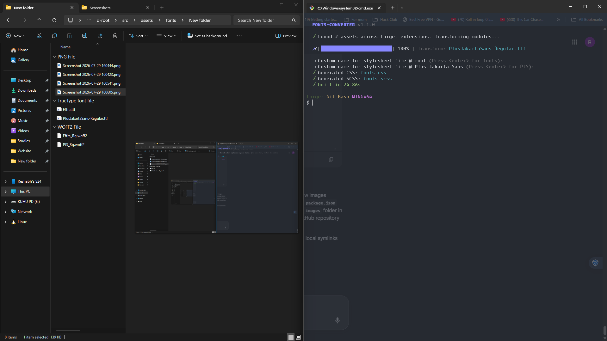
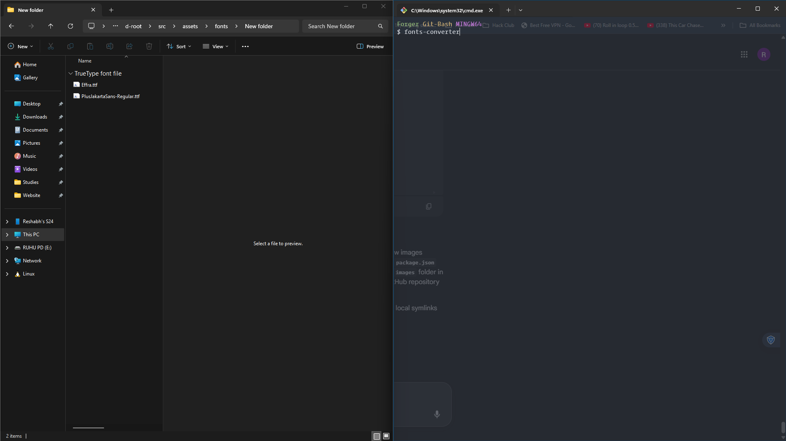
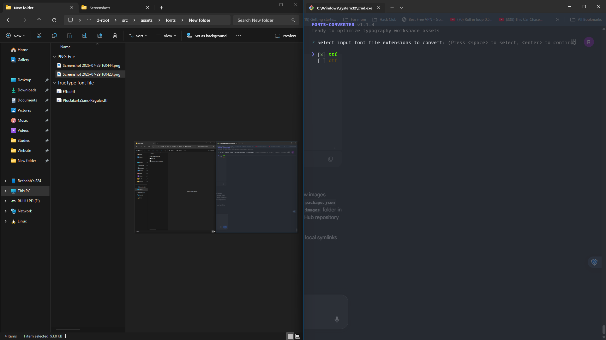
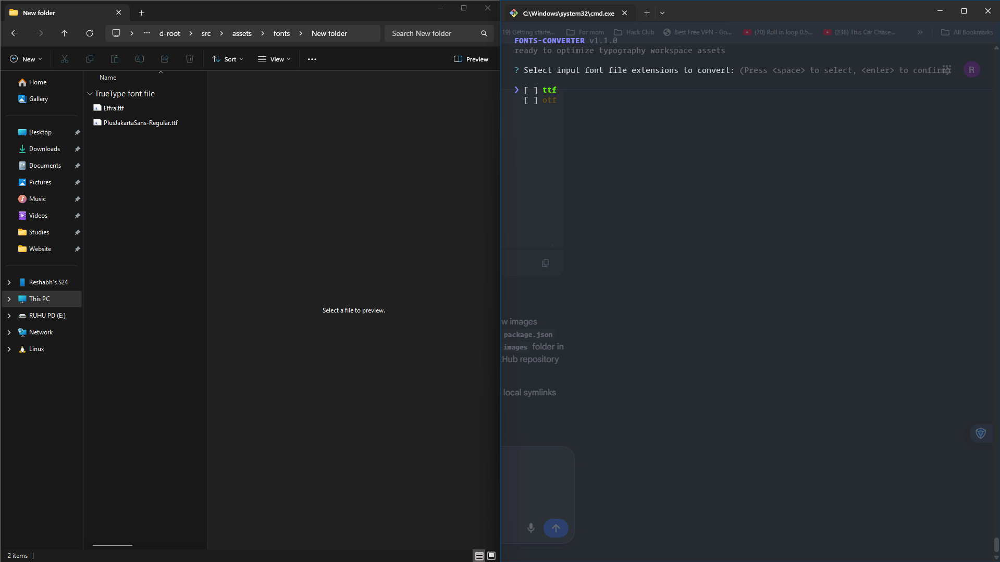
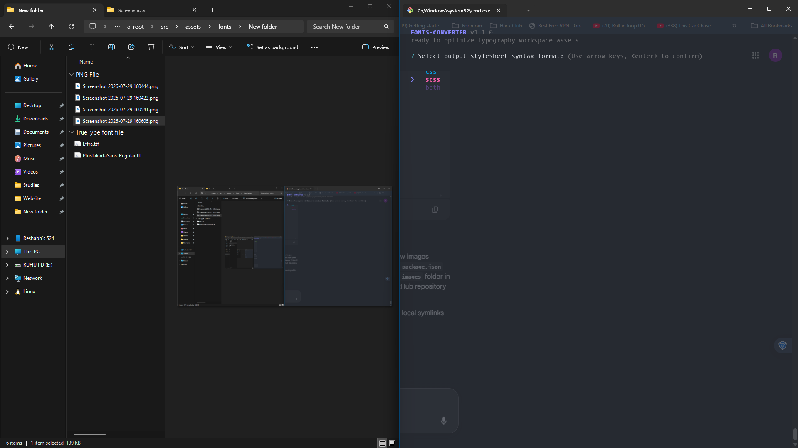
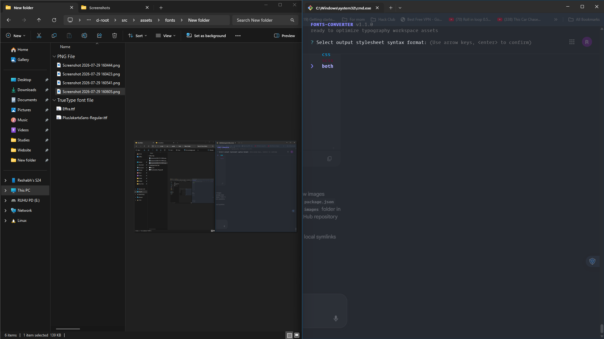
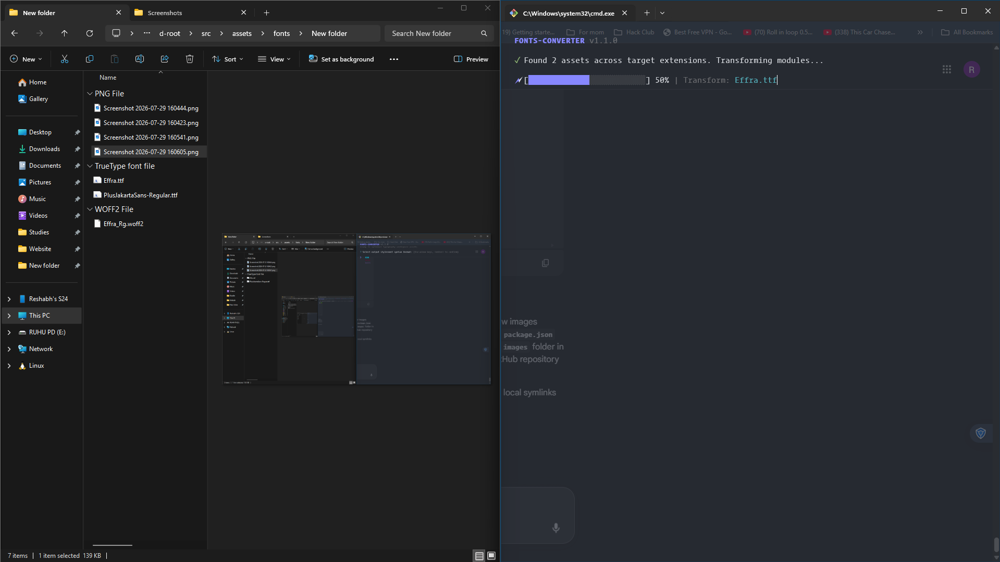
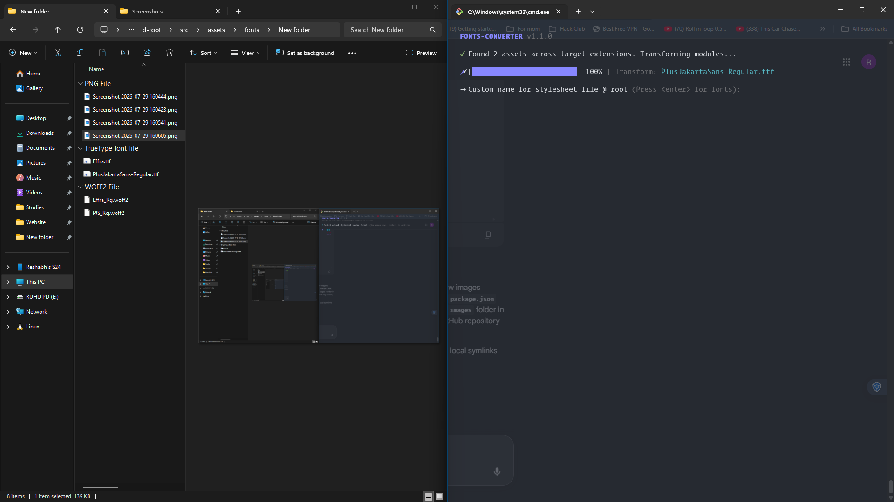

# fonts-converter

An ultra-fast, zero-config web font optimizer that batch-converts TTF and OTF fonts into highly compressed WOFF2 assets. It automatically generates dedicated CSS/SCSS stylesheets named directly after short initials, outputs hyper-short filenames, but keeps your `font-family` definitions 100% human-readable inside your style sheets.

<p align="center">
  
</p>


## 🗲 Features

- **Interactive Selection Menus**: Visual terminal UIs to choose input formats (`ttf`/`otf`) and select preferred stylesheet formats via standard keyboard keys.
- **Smart Name Compression**: Converts long files like `PlusJakartaSans-ExtraLightItalic.ttf` into hyper-short production names like `PJS_Ex_Lt_Ital.woff2`.
- **Dual-Syntax Scoping**: Generates clean, standard `@font-face` rules for CSS, or includes automated utility `@mixin` files for SCSS workflows.
- **Dynamic Renaming Wizard**: Built-in prompt to custom-name your root master bundle or directory-level style files on the fly.
- **Real-Time Progress Tracking**: Beautiful, fluid terminal loading bar inspired by modern Vite build setups.

## 🚀 Installation

```bash
# Run instantly from any workspace without permanent installation
npx fonts-converter

# Or install globally onto your system machine
npm install -g fonts-converter
```

## 🛠 Interactive Workflow

### 1. Select Font File Formats (Unchecked State)
The initial terminal screen showing your multi-select font target options before any options are activated.

<p align="center">
  
</p>

### 2. Select Font File Formats (Checked Selection)
Using the spacebar to toggle your target extensions (`ttf`/`otf`) before hitting enter to confirm.

When No Font File Format is Chosen:
<p align="center">
  
</p>

When 1 or More Font File Format is Chosen:
<p align="center">
  
</p>

### 3. Select Stylesheet Formats
Pick your preferred output styling architecture (`css`, `scss`, or export both layouts together).
<p align="center">
  
</p>

### 4. Conversion Process (Initializing Modules)
The module scans your folders, prints total discovered assets, and boots up your real-time processing indicator trackers.
<p align="center">
  
</p>

### 5. Conversion Process (Batch Processing)
Watch your font files optimize simultaneously under a fluid, custom ANSI progress indicator bar.
<p align="center">
  
</p>

### 6. File Naming Wizard
Provide custom names for your root master bundle or folder-level typography overrides directly inside your terminal prompts.
<p align="center">
  
</p>

### 7. File Writing Execution
The tool safely generates your custom layout structural style models and commits them to your local directory paths.
<p align="center">
  
</p>

### 8. Task Completion
View your build duration diagnostics and a clean success breakdown summary.
<p align="center">
  
</p>

## 📂 Output Structure Example

- **Input asset**: `PlusJakartaSans-ExtraLightItalic.ttf`
- **Output filename**: `PJS_Ex_Lt_Ital.woff2`
- **Output stylesheet**: `PJS.css` (or `_PJS.scss`)

### Generated `PJS.css` Layout:
```css
/* Generated by fonts-converter for Plus Jakarta Sans */

@font-face {
  font-family: 'Plus Jakarta Sans';
  src: url('./PJS_Ex_Lt_Ital.woff2') format('woff2');
  font-weight: 200;
  font-style: italic;
  font-display: swap;
}
```

## 📄 License

MIT © Reshabh Ohall
